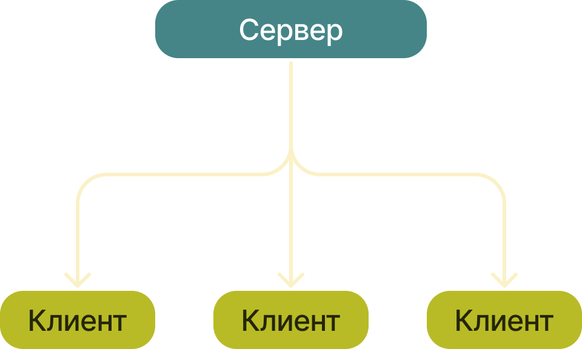
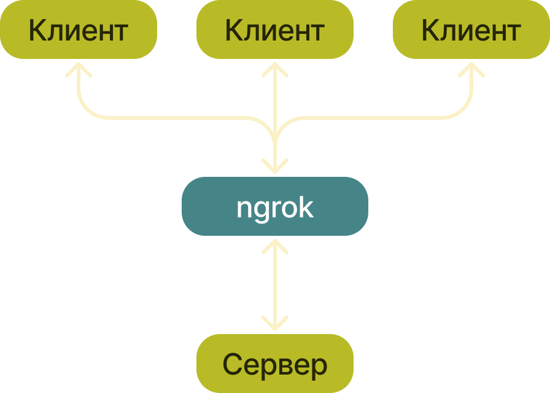
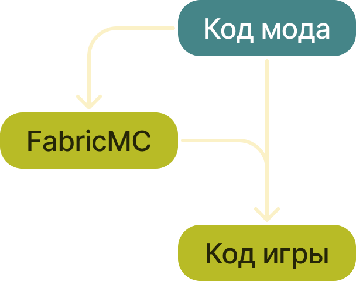
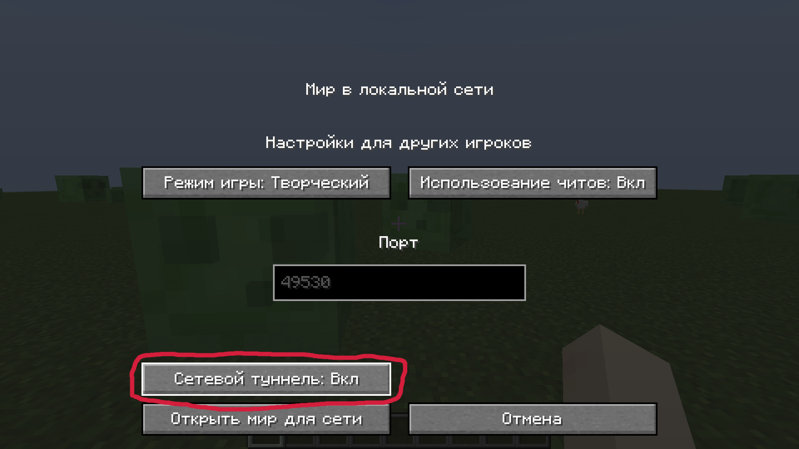

## Разработка модификации для игры <g>Minecraft</g>
<gr>Подготовил:</gr> Тришин Андрей

---
>**Модификация** (моддинг игр, прог. жарг. «мод») — изменение компьютерной игры, осуществлённое кем-либо, кроме её разработчиков.

<gr>Источник:</gr> Википедия

---
>Самой продаваемой видеоигрой на сегодняшний день является <g>Minecraft</g>, игра-песочница, выпущенная Mojang в мае 2009 года

<gr>Источник:</gr> Википедия

---

Сетевая игра в <g>Minecraft</g> реализована по принципу клиент-сервер

---

<gr>Историческое фото:</gr>
LAN-вечеринка игроков в <g>Minecraft</g>.
<gr>2012 год</gr>
<dgr>Источник: https://bit.ly/3hRVoOt</dgr>

---
#### Философия <g>Unix</g> гласит:
>* Пишите программы, которые делают что-то одно и делают это хорошо.
>* Пишите программы, которые бы работали вместе.

<gr>Источник:</gr> Википедия

---

Принцип работы <g>ngrok</g>

---

Одним из самых популярных инструментов для моддинга Minecraft является <g>FabricMC</g>

---

---
### Команды мода:
* <gr>/tunnel open</gr> - открывает туннель
* <gr>/tunnel close</gr> - закрывает туннель
* <gr>/tunnel token <g>[токен]</g></gr> - задаёт токен ngrok
* <gr>/tunnel region <g>[регион]</g></gr> - задаёт регион ngrok
* <gr>/tunnel copyip</gr> - копирует IP туннеля в буффер обмена
* <gr>/tunnel options</gr> - открывает меню настроек мода

---
# Спасибо за внимание